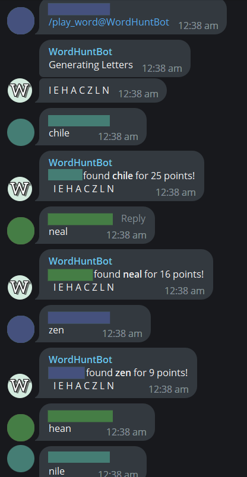
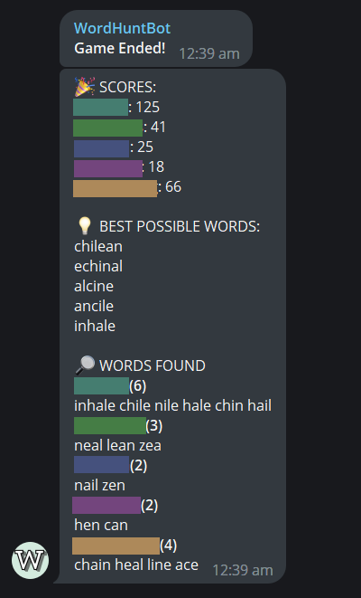

# Word Hunt 

## About 

A Telegram bot built in Python to play a word search game with friends.

## How to Play
Try to score the most points by forming words from the letters given and typing them into the chat.

Each letter that appears in the letter row can only be used once. *(e.g. If 'G' appears once, it can only be used once per word, but if 'G' appears twice it can be used twice in the word.)*

Once a word has been scored, other players will not score points by typing the word.

The points awarded for each word is equal to the length of the word squared.

Each game lasts for 45 seconds.

/play - Starts a game.
/end - Ends a game.
/help - Help message.

## Screenshots

Player names and profile photos in the screenshot removed for privacy. The bot will display your Telegram username in the scoring phase.

**Starting the Game**

**Ending the Game**
